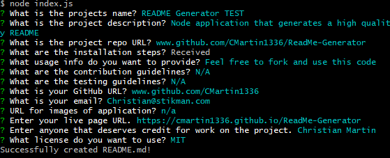

# ReadMe-Generator 
README File Generator using Node

# Description
Develop a node application to generate high quality README files in the terminal

# Image
  

# Installation
1. Create repo
2. Initialize NPM and install inquirer
3. Build base README.md structure in index.js file
4. Insert prompts and a way to spit that out onto a file
5. Run node index.js in terminal and build README.md

# Live Project
https://cmartin1336.github.io/ReadMe-Generator/

# Credit
Christian Martin

# License
Copyright © 2021 [Christian Martin](www.github.com/CMartin1336)  
This project is [GNU](https://github.com/CMartin1336/ReadMe-Generator/blob/main/LICENSE) licensed.