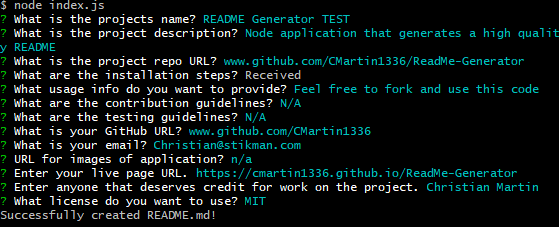

  # README Generator Sample 
  
  # Description
  Node application that generates a high quality readme

  # Table of Contents
  1. [Installation](#installation)
  2. [Images](#images)
  2. [Usage](#usage)
  3. [Contributing](#contributing)
  4. [Testing](#testing)
  5. [Questions](#questions)
  6. [Live Project](#live-project)
  7. [Credit](#credit)
  8. [License](#license)
    
  # Installation
  1. Test
2. Test
3. Test
4. Test
5. Test

  # Images
  

  # Usage
  This is an open source project

  # Contributing
  N/A

  # Testing
  N/A

  # Questions
  GitHub: www.github.com/CMartin1336  
  Email: Christian@stikman.com
  
  # Live Project
  https://cmartin1336.github.io/ReadMe-Generator

  # Credit
  Christian Martin
  
  # License
  This project is [MIT](www.github.com/CMartin1336/ReadMe-Generator/blob/main/LICENSE) licensed.
  